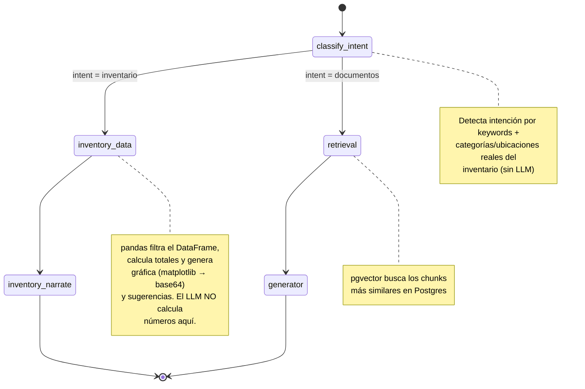

# 🚀 Asistente RAG + Inventario — OCI Oracle Linux 9 ARM

Sistema de recuperación aumentada por IA (RAG) que permite consultar **documentos internos** y el **inventario del supermercado** en lenguaje natural, usando embeddings, PostgreSQL + pgvector, pandas/matplotlib y modelos LLM locales con Ollama.

Desplegado sobre **Oracle Cloud Infrastructure (OCI)**, en una instancia **Ampere A1 (ARM64)** con **Oracle Linux 9**.

---

## 🎥 Demo del proyecto

> _Video de demostración:_

<!--
  Pega aquí el video una vez subido. GitHub permite arrastrar archivos de video
  (mp4, mov, webm) directamente en el editor web del README y los renderiza
  como un reproductor embebido. Pasos:

  1. Entra a este archivo en github.com y pulsa el ícono de lápiz (Edit).
  2. Arrastra tu archivo de video sobre el área de texto del editor.
  3. GitHub lo sube y pega automáticamente un enlace tipo:
     https://github.com/user-attachments/assets/xxxxxxxx-xxxx-xxxx-xxxx-xxxxxxxxxxxx
  4. Deja ese enlace en una línea sola (sin corchetes de imagen) y GitHub
     renderiza un reproductor de video inline al hacer commit.

  Si el archivo pesa más de lo permitido por tu plan, sube el video como
  "asset" en un Release o en un Issue/PR (mismo mecanismo de drag & drop)
  y copia el enlace generado aquí.
-->

El sistema permite:

- 📄 Subir documentos PDF y convertirlos en embeddings semánticos
- 🔎 Buscar información relevante por similitud vectorial (pgvector)
- 📦 Consultar el **inventario** (stock, ubicaciones, vencimientos) sin usar embeddings — con pandas
- 📊 Generar **gráficas** automáticas de stock (matplotlib) dentro del chat
- 💬 Responder en lenguaje natural con un LLM local (Ollama)
- 💡 Sugerir preguntas de seguimiento relacionadas con la consulta

---

## 🏗️ Arquitectura del sistema

```text
                         ┌─────────────────────────┐
                         │   Nginx (80 / 443)       │
                         │   Reverse proxy + TLS    │
                         └────────────┬─────────────┘
                                      │
                                      ▼
                         ┌─────────────────────────┐
                         │  Node.js (Express)       │
                         │  server.js  :3000        │
                         │  - Sirve frontend        │
                         │  - Sube PDFs (multer)    │
                         │  - Proxy /api/*          │
                         └──────┬──────────┬────────┘
                                │          │
                 ┌──────────────┘          └──────────────┐
                 ▼                                         ▼
    ┌────────────────────────┐              ┌──────────────────────────────┐
    │ Flask · Embedding       │              │ Flask · Chat backend          │
    │ embedding_backend.py    │              │ chat_backend.py  :6000        │
    │ :5000                   │              │ LangGraph:                    │
    │ - Extrae texto de PDF   │              │  classify_intent              │
    │ - Genera embeddings     │              │   ├─ documentos → retrieval   │
    │ - Inserta en pgvector   │              │   │    → generator (LLM)      │
    └───────────┬─────────────┘              │   └─ inventario → pandas      │
                │                              │        → gráfica (matplotlib)│
                ▼                              │        → narrate (LLM)       │
    ┌────────────────────────┐              └──────────────┬────────────────┘
    │ PostgreSQL + pgvector   │                             │
    │ tabla documents         │                             ▼
    └────────────────────────┘              ┌──────────────────────────────┐
                                             │ Inventario_supermercado.xlsx  │
                                             │ (cargado en memoria, pandas)  │
                                             └──────────────────────────────┘

                 ambos backends Python usan Ollama (127.0.0.1:11434)
                 modelos: bge-m3 (embeddings) · qwen2.5:3b (chat)
```

---

## 🧠 Grafo de LangGraph (`chat_backend.py`)



**Nodos:**

| Nodo | Función |
|---|---|
| `classify_intent` | Decide si la pregunta es sobre **inventario** o **documentos** |
| `retrieval` | Búsqueda semántica en `pgvector` (documentos PDF) |
| `generator` | LLM redacta la respuesta usando el contexto recuperado |
| `inventory_data` | Filtra/agrega el inventario con pandas, genera gráfica y sugerencias |
| `inventory_narrate` | LLM redacta la respuesta usando **solo** los números ya calculados |

---

## 🧩 Tecnologías utilizadas

| Componente | Uso |
|---|---|
| **Oracle Linux 9 ARM64** | Sistema operativo (OCI Ampere A1) |
| **PostgreSQL + pgvector** | Almacenamiento y búsqueda semántica de documentos |
| **Ollama** (`bge-m3`, `qwen2.5:3b`) | Embeddings y generación de texto en local |
| **LangGraph** | Orquestación del flujo conversacional (documentos vs inventario) |
| **Flask** | APIs REST (`embedding_backend.py`, `chat_backend.py`) |
| **pandas + matplotlib** | Consultas estructuradas y gráficas del inventario |
| **Node.js + Express + Multer** | Frontend, subida de PDFs y proxy hacia los backends Flask |
| **Nginx** | Reverse proxy / punto de entrada único (80/443) |
| **systemd** | Gestión de los tres servicios como procesos persistentes |

---

## ✅ Prerrequisitos

- Instancia OCI **Ampere A1** (ARM64), Oracle Linux 9, mínimo 4 OCPU / 16 GB RAM recomendado (Ollama + Postgres + Node conviven).
- Acceso `ssh` con un usuario con privilegios `sudo`.
- Puertos abiertos en el **Security List / Network Security Group** de OCI: `22`, `80`, `443` (los puertos 3000/5000/6000/5432/11434 quedan internos, solo `127.0.0.1`).

Todo el despliegue corre bajo el usuario de servicio **`agente`**, en `/opt/agente/`.

---

## ⚙️ Instalación paso a paso (Oracle Linux 9 ARM)

### 1. Actualizar el sistema y crear el usuario de servicio

```bash
sudo dnf update -y
sudo dnf install -y git curl wget policycoreutils-python-utils firewalld

sudo useradd -m -d /opt/agente -s /bin/bash agente
sudo passwd -l agente          # sin login por password, solo sudo -u
```

### 2. PostgreSQL 16 + pgvector

```bash
sudo dnf install -y https://download.postgresql.org/pub/repos/yum/reporpms/EL-9-aarch64/pgdg-redhat-repo-latest.noarch.rpm
sudo dnf -qy module disable postgresql
sudo dnf install -y postgresql16-server postgresql16-contrib postgresql16-devel gcc

sudo /usr/pgsql-16/bin/postgresql-16-setup initdb
sudo systemctl enable --now postgresql-16

# Compilar e instalar pgvector
git clone --branch v0.7.4 https://github.com/pgvector/pgvector.git /tmp/pgvector
cd /tmp/pgvector
export PATH=/usr/pgsql-16/bin:$PATH
make
sudo make install
```

Crear la base de datos y el usuario de la app:

```bash
sudo -u postgres psql <<'SQL'
CREATE USER chatbot_user WITH PASSWORD 'CAMBIA_ESTA_CLAVE';
CREATE DATABASE chatbot_db OWNER chatbot_user;
\c chatbot_db
CREATE EXTENSION IF NOT EXISTS vector;
SQL
```

Habilita autenticación por contraseña para conexiones locales en `pg_hba.conf` (`/var/lib/pgsql/16/data/pg_hba.conf`, método `scram-sha-256`) y reinicia:

```bash
sudo systemctl restart postgresql-16
```

### 3. Ollama + modelos

```bash
curl -fsSL https://ollama.com/install.sh | sh
sudo systemctl enable --now ollama

ollama pull bge-m3
ollama pull qwen2.5:3b
```

### 4. Node.js 20 LTS

```bash
curl -fsSL https://rpm.nodesource.com/setup_20.x | sudo bash -
sudo dnf install -y nodejs
node -v && npm -v
```

### 5. Clonar el repositorio en `/opt/agente`

```bash
sudo -u agente -i
cd /opt/agente
git clone https://github.com/gbriones1234/CHALLENGUE_ALURA.git .
```

> Ajusta las rutas siguientes (`backend/`, `embedding/`, `frontend/`) al árbol real de tu repo si difiere — este README asume una separación por carpetas de cada servicio.

### 6. Backend Python (embeddings + chat/inventario)

```bash
cd /opt/agente/backend
python3.12 -m venv venv
source venv/bin/activate

pip install --upgrade pip
pip install flask psycopg2-binary python-dotenv ollama langgraph \
            pandas matplotlib openpyxl PyPDF2 gunicorn
```

Coloca el Excel del inventario en el servidor, por ejemplo:

```bash
cp Inventario_supermercado.xlsx /opt/agente/backend/data/
```

Archivo `.env` (mismo para `chat_backend.py` y `embedding_backend.py`):

```env
DB_NAME=chatbot_db
DB_USER=chatbot_user
DB_PASSWORD=CAMBIA_ESTA_CLAVE
DB_HOST=127.0.0.1
DB_PORT=5432
INVENTORY_XLSX_PATH=/opt/agente/backend/data/Inventario_supermercado.xlsx
```

Prueba manual antes de crear los servicios:

```bash
python chat_backend.py        # puerto 6000
python embedding_backend.py   # puerto 5000 (en otra terminal)
```

### 7. Frontend Node.js

```bash
cd /opt/agente/frontend
npm install express multer axios
mkdir -p uploads
```

Coloca `index.html` y `app.js` dentro de `frontend/public/`.

Prueba manual:

```bash
node server.js                # puerto 3000
```

---

## 🧷 Servicios systemd (usuario `agente`)

Crea los tres archivos como `root`:

**`/etc/systemd/system/agente-chat.service`**
```ini
[Unit]
Description=Chat backend (LangGraph RAG + Inventario)
After=network.target postgresql-16.service ollama.service

[Service]
User=agente
WorkingDirectory=/opt/agente/backend
EnvironmentFile=/opt/agente/backend/.env
ExecStart=/opt/agente/backend/venv/bin/gunicorn chat_backend:app \
    --workers 1 --threads 4 --timeout 120 \
    --bind 127.0.0.1:6000 --worker-class gthread
Restart=on-failure
RestartSec=5

[Install]
WantedBy=multi-user.target
```

**`/etc/systemd/system/agente-embedding.service`**
```ini
[Unit]
Description=Embedding backend (PDF -> pgvector)
After=network.target postgresql-16.service ollama.service

[Service]
User=agente
WorkingDirectory=/opt/agente/backend
EnvironmentFile=/opt/agente/backend/.env
ExecStart=/opt/agente/backend/venv/bin/gunicorn embedding_backend:app \
    --workers 2 --threads 2 --timeout 120 \
    --bind 127.0.0.1:5000
Restart=on-failure
RestartSec=5

[Install]
WantedBy=multi-user.target
```

**`/etc/systemd/system/agente-frontend.service`**
```ini
[Unit]
Description=Frontend Node.js (Express)
After=network.target agente-chat.service agente-embedding.service

[Service]
User=agente
WorkingDirectory=/opt/agente/frontend
ExecStart=/usr/bin/node server.js
Restart=on-failure
RestartSec=5
Environment=NODE_ENV=production

[Install]
WantedBy=multi-user.target
```

> `agente-chat` usa **1 worker**: el semáforo de inferencia LLM y el DataFrame del inventario en memoria son por proceso — con más de un worker perderías la serialización y duplicarías la RAM del inventario.

Activar todo:

```bash
sudo systemctl daemon-reload
sudo systemctl enable --now agente-embedding agente-chat agente-frontend
sudo systemctl status agente-chat agente-embedding agente-frontend
journalctl -u agente-chat -f     # logs en vivo
```

---

## 🌐 Nginx — reverse proxy y URLs expuestas

```bash
sudo dnf install -y nginx
sudo systemctl enable --now nginx
```

**`/etc/nginx/conf.d/agente.conf`**
```nginx
server {
    listen 80;
    server_name tu-dominio-o-ip;

    client_max_body_size 25M;   # PDFs

    location / {
        proxy_pass         http://127.0.0.1:3000;
        proxy_set_header    Host $host;
        proxy_set_header    X-Real-IP $remote_addr;
        proxy_set_header    X-Forwarded-For $proxy_add_x_forwarded_for;
        proxy_set_header    X-Forwarded-Proto $scheme;
    }
}
```

Todo el tráfico entra por Nginx → Node (`server.js`), y Node reenvía internamente a los backends Flask en `127.0.0.1:5000` / `127.0.0.1:6000` (ya configurado en `server.js`). Los puertos 3000/5000/6000/5432/11434 **no** se exponen fuera de la VM.

```bash
sudo nginx -t
sudo systemctl reload nginx
```

**URLs finales (con Nginx delante):**

| Ruta | Descripción |
|---|---|
| `http://tu-dominio-o-ip/` | Interfaz de chat |
| `http://tu-dominio-o-ip/upload` | Subida de PDF |
| `http://tu-dominio-o-ip/api/chat` | Consulta (documentos o inventario) |
| `http://tu-dominio-o-ip/api/embed/documents` | Lista de documentos indexados |
| `http://tu-dominio-o-ip/api/inventory/reload` | Recarga el Excel de inventario sin reiniciar el servicio |

Para HTTPS, usa `certbot --nginx` (paquete `python3-certbot-nginx`) una vez tengas un dominio apuntando a la IP pública de la instancia.

### Firewall (dentro de la VM)

```bash
sudo firewall-cmd --permanent --add-service=http
sudo firewall-cmd --permanent --add-service=https
sudo firewall-cmd --reload
```

Recuerda también abrir `80`/`443` en el **Security List** o **Network Security Group** de la VCN en la consola de OCI — sin eso, `firewall-cmd` no es suficiente.

---

## 💬 Preguntas de ejemplo

### Documentos (RAG con pgvector)
- ¿Cuál es la política de atención al cliente?
- ¿Cuáles son los principios de Mercado Central 24h?

### Inventario (pandas, sin embeddings)
- ¿Cuántos abarrotes quedan en stock?
- ¿Qué stock hay de Lácteos?
- ¿Qué hay en el Pasillo 15?
- ¿Qué productos tienen stock bajo? *(genera gráfica automáticamente)*
- ¿Qué productos vencen en los próximos 30 días?
- Gráfica de stock por categoría
- Muéstrame una gráfica de stock de Bebidas
- ¿Cuántos productos de Limpieza tienen stock bajo?
- ¿Cuánto stock hay de Arroz Arborio 1kg?
- ¿Dónde está el Yogur Natural 170g?

---

## 📁 Estructura del proyecto (asumida)

```text
/opt/agente/
├── backend/
│   ├── chat_backend.py
│   ├── embedding_backend.py
│   ├── data/Inventario_supermercado.xlsx
│   ├── .env
│   └── venv/
└── frontend/
    ├── server.js
    ├── uploads/
    └── public/
        ├── index.html
        └── app.js
```

---

## 🛠️ Troubleshooting

```bash
# Ver logs de cada servicio
journalctl -u agente-chat -f
journalctl -u agente-embedding -f
journalctl -u agente-frontend -f

# Probar el chat backend directo, sin pasar por Nginx/Node
curl -X POST http://127.0.0.1:6000/api/chat \
     -H "Content-Type: application/json" \
     -d '{"query":"cuantos abarrotes quedan en stock"}'

# Confirmar que Ollama tiene los modelos
ollama list

# Confirmar la extensión pgvector
sudo -u postgres psql -d chatbot_db -c "\dx"
```
